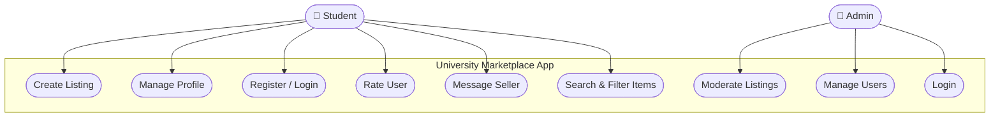
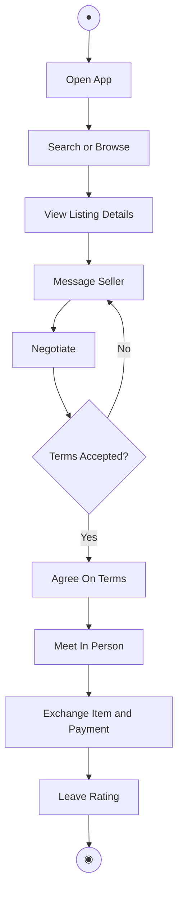
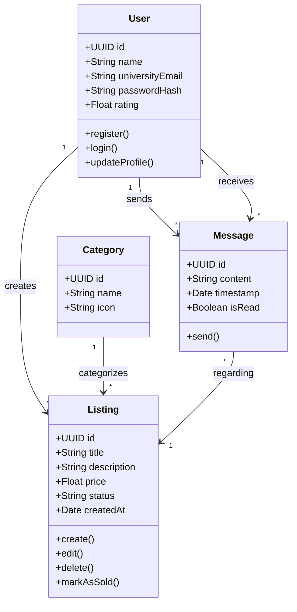
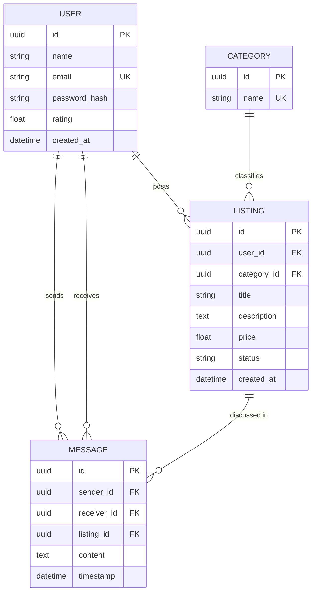
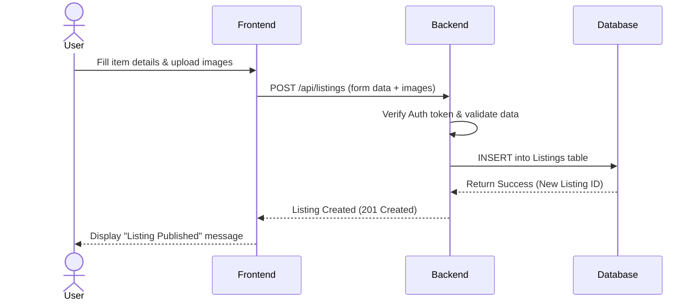

# UniTrade — University Marketplace App
### Project Idea & Requirements Document

---

## Table of Contents

1. [General Idea](#1-general-idea)
2. [Chapter 1 — Introduction](#chapter-1--introduction)
   - 1.1 [Current Situation & Opportunity](#11-description-of-the-current-situation-and-opportunity)
   - 1.2 [Related Work](#12-related-work)
   - 1.3 [Problem Statement](#13-problem-statement--limitation-of-current-systems)
   - 1.4 [Problem Solution](#14-problem-solution)
   - 1.5 [Project Objectives](#15-project-objectives)
3. [Chapter 2 — Requirements & Analysis](#chapter-2--requirements--analysis)
   - 2.1 [Software Process Model](#21-software-process-model)
   - 2.2 [System Scope](#22-system-scope)
   - 2.3 [Functional & Non-Functional Requirements](#23-functional--non-functional-requirements)
4. [Chapter 3 — System Design](#chapter-3--system-design)
   - 3.1 [Use Case Diagram](#31-use-case-diagram)
   - 3.2 [Activity Diagram — Buyer Transaction Flow](#32-activity-diagram--buyer-transaction-flow)
   - 3.3 [Class Diagram](#33-class-diagram)
   - 3.4 [Entity-Relationship (ER) Diagram](#34-entity-relationship-er-diagram)
   - 3.5 [Sequence Diagram — Create Listing](#35-sequence-diagram--create-listing)

---

## 1. General Idea

**UniTrade** is a mobile application that acts as a trusted platform and middleman service exclusively for university students. It enables sellers to quickly and safely offload items they no longer need — such as used textbooks, lab coats, lab equipment, dorm furniture, and stationery — while giving buyers a structured catalog to browse for exactly the academic items they need each semester, without paying a retail premium.

The core value proposition is **safety, structure, and locality**. Unlike generic marketplaces or informal social media groups, UniTrade is:

- **Closed to verified university students only** (via `@students.edu.jo` or university-issued email verification)
- **Structured** with category-based browsing, course code tagging, and price filtering
- **Secure** through in-app messaging, user ratings, and a QR-code-based transaction confirmation system
- **Convenient** by eliminating the need for direct peer contact — all communication and transaction confirmation flows through the platform

The result is a mobile-first marketplace where verified users can post academic items for sale, browse listings, message sellers, negotiate, and securely confirm a physical cash transaction using a QR code handshake — all within a single application.

---

## Chapter 1 — Introduction

### 1.1 Description of the Current Situation and Opportunity

University students frequently purchase items such as textbooks, stationery, dorm furniture, electronics, lab equipment, and course-specific supplies that they only need for a limited period — typically a single semester or until graduation. Once their need for these items ends, students are left with goods that hold residual value but no convenient outlet to convert them back into cash.

Currently, students rely on a fragmented set of informal channels to sell or acquire second-hand items: physical bulletin boards pinned with handwritten notices in campus hallways, informal WhatsApp and Telegram group chats, and generic online marketplaces such as Facebook Marketplace. These solutions share a critical weakness — none of them are designed with the university community in mind, and none offer the safety guarantees, structured search capabilities, or community trust that students require.

This gap represents a clear and compelling opportunity. A dedicated, university-exclusive, secure, and localized marketplace application tailored specifically for the campus community would address an unmet need, reduce waste, save students money, and build a stronger campus economy built on peer-to-peer trust.

---

### 1.2 Related Work

Existing solutions for second-hand trading generally fall into two categories, each with meaningful limitations in the university context:

**Generic Online Marketplaces (e.g., Facebook Marketplace, Craigslist, eBay)**
These platforms benefit from a massive user base and broad reach, but they are fundamentally misaligned with university needs. Users must interact with strangers from outside their community, handle complex shipping logistics, and navigate platforms that offer no university-specific trust or verification. There is no filtering by course code, no guarantee that the seller is a fellow student, and no campus-aware meeting coordination.

**Social Media Groups (e.g., University-specific Facebook Groups, WhatsApp Chats)**
These channels are more localized and feel more personal, but they lack structured e-commerce features entirely. There is no search functionality, no consistent categorization, no in-app payment or transaction confirmation, and no rating system. Listings posted in a group chat are buried within hours as new messages arrive, making discovery unreliable and frustrating.

Neither category provides a solution that is simultaneously localized, structured, secure, and campus-aware — the exact combination UniTrade is designed to deliver.

---

### 1.3 Problem Statement — Limitation of Current Systems

The core problem is the **absence of a centralized, secure, and purpose-built platform** for university students to trade academic items locally. This absence results in four compounding friction points:

1. **Lack of Trust & Security** — Transacting with anonymous buyers or sellers on generic platforms carries real safety risks, both physical (meeting strangers) and digital (no verified identity). Students are exposed to scams, no-shows, and unsafe meetups.

2. **Inefficiency in Discovery** — Searching for a specific item (such as a particular course textbook or a specialized lab coat in a given size) within an unstructured social media group is tedious, time-consuming, and largely unsuccessful. There is no filtering, no tagging, and no standardized listing format.

3. **Inconvenience in Coordination** — Without a dedicated communication and transaction confirmation system, coordinating meetups, negotiating prices, and finalizing exchanges introduces significant friction. Conversations are scattered across different platforms and easy to lose track of.

4. **No Accountability Mechanism** — There is no reputation system, no transaction history, and no way for buyers and sellers to build trust incrementally through past interactions. Every transaction starts from zero trust.

---

### 1.4 Problem Solution

The proposed solution is **UniTrade** — a mobile and web-based application exclusive to university students, verified via `@students.edu.jo` university-issued email addresses.

The application provides a structured, safe, and community-aware marketplace where students can:

- **List items** with photos, descriptions, categories, course code tags, and prices
- **Browse and search** using a clean, category-based catalog with keyword search and multi-dimensional filters (category, course code, price range)
- **Communicate securely** through a built-in in-app messaging system that keeps personal contact details hidden
- **Confirm transactions** using a QR code handshake system, eliminating the need for direct exchange of personal information
- **Build reputation** through a post-transaction star rating and review system that creates accountability and community trust over time

The platform serves as a trusted middleman — verifying both parties, facilitating communication, and confirming the exchange — so that neither buyer nor seller ever needs to interact outside the safety of the app's ecosystem.

---

### 1.5 Project Objectives

**Primary Objective**
To develop a secure, efficient, and community-exclusive marketplace application for university students that enables them to buy and sell used academic and personal items in a trusted environment.

**Secondary Objectives**

- **Verification** — To implement a university email verification system (`@students.edu.jo` domain restriction + email confirmation link) that ensures a fully trusted, university-exclusive user base.
- **Discovery** — To provide advanced search and filtering capabilities, including filtering by item category, course code, and maximum price, so buyers can find exactly what they need quickly.
- **Communication** — To include a real-time in-app messaging system that allows buyers and sellers to negotiate and coordinate without exchanging personal contact information.
- **Transaction Confirmation** — To implement a QR code-based transaction confirmation flow that allows both parties to securely confirm a completed physical cash exchange within the app.
- **Sustainability** — To promote a culture of sustainability on campus by making it significantly easier for students to reuse and recirculate goods rather than purchasing new.

---

## Chapter 2 — Requirements & Analysis

### 2.1 Software Process Model

**Selected Model: Agile Methodology (Scrum)**

The project will be developed using the Agile Scrum framework, organized into two-week sprint cycles. Each sprint will deliver a functional, testable increment of the application — for example, Sprint 1 focuses on User Authentication, Sprint 2 on Item Listings, Sprint 3 on Messaging, and so on.

Agile is the appropriate choice for this project for several reasons. UniTrade is a highly user-centric application whose success depends on product-market fit within a specific community — university students. Early and continuous feedback from a real subset of student users is essential to validate features, surface usability issues, and adjust priorities. The iterative nature of Scrum accommodates this feedback loop naturally. Additionally, the core feature set is well-understood but the priority and shape of individual features may evolve as real-world usage patterns emerge. Agile's flexibility allows the team to pivot without discarding already-delivered value.

---

### 2.2 System Scope

The system encompasses a **mobile application** (Flutter — Android primary, iOS secondary) for students, and a **basic admin dashboard** for content moderation and user management.

**In Scope for Version 1.0:**
- User registration and login with university email domain verification
- User profile management (display name, avatar, rating display)
- Creating, editing, and deleting item listings (with photos, title, description, category, price)
- Searching and filtering listings by keyword, category, course code, and price
- In-app messaging between buyers and sellers
- Post-transaction star rating and review submission
- QR code transaction confirmation flow
- Admin panel for moderating listings and managing flagged users

**Out of Scope for Version 1.0:**
- In-app payment gateways (all transactions are handled in person to avoid legal and financial regulatory complexity in the initial release)
- Integrated item delivery or shipping logistics
- Cross-university trading between different institutions
- Advanced analytics or seller dashboards

---

### 2.3 Functional & Non-Functional Requirements

#### Functional Requirements (FRs)

| ID | Requirement |
|----|-------------|
| FR1 | The system shall require users to register using a valid university email address and complete email verification before accessing the marketplace. |
| FR2 | Verified users shall be able to create item listings that include one or more photos, a title, a description, a category, an optional course code tag, and a price. |
| FR3 | Users shall be able to search for items using free-text keywords and apply filters by category, course code, and maximum price. |
| FR4 | The system shall provide a secure, in-app real-time chat interface for buyers to contact sellers regarding specific listings. |
| FR5 | Users shall be able to submit a star rating (1–5) and a written review for the other party after a completed transaction has been confirmed. |
| FR6 | The system shall provide a QR code handshake mechanism for buyers and sellers to mutually confirm a completed in-person cash transaction. |
| FR7 | Admin users shall be able to view, moderate, and remove listings or suspend accounts that violate platform policies. |

#### Non-Functional Requirements (NFRs)

| ID | Category | Requirement |
|----|----------|-------------|
| NFR1 | Security | All user passwords must be securely hashed using a modern hashing algorithm. Personal contact information (phone number, personal email) must be hidden from other users by default and never exposed in listings or chat. |
| NFR2 | Performance | Search results and listing feeds must load in under 2 seconds under normal network conditions. Image assets must be compressed before upload to minimize bandwidth usage. |
| NFR3 | Usability | The user interface must be intuitive, modern, and fully accessible on mobile devices with screen widths from 360dp to 428dp. The app must be operable with one hand and require no onboarding tutorial for core flows. |
| NFR4 | Reliability | The system shall maintain 99% uptime, with heightened availability guaranteed during peak academic periods (beginning and end of each semester) when trading volume is highest. |

---

## Chapter 3 — System Design

### 3.1 Use Case Diagram

#### Explanation

The Use Case Diagram for UniTrade identifies two primary system actors: the **Student** and the **Admin**. Each actor interacts with the system through a distinct set of use cases that reflect their role and permissions within the platform.

The **Student** actor represents any verified university user of the application. Students engage with the full set of marketplace functionality available to regular users. They begin their journey with **Register / Login**, which enforces `.edu` email verification to ensure only legitimate university community members gain access. Once authenticated, students can **Manage Profile** — updating their display name, avatar, and viewing their personal rating. The **Create Listing** use case allows sellers to post items for sale with photos, descriptions, categories, and pricing. On the buyer side, **Search & Filter Items** enables discovery of relevant listings using keyword search and multi-dimensional filters. **Message Seller** facilitates direct, secure in-app communication between interested buyers and item owners. Finally, **Rate User** closes the transaction loop, allowing both parties to submit reviews that build the community trust layer over time.

The **Admin** actor represents the platform operator or moderation team. Admins interact with a separate, privileged set of use cases focused on platform governance. **Login** grants admin access to the backend dashboard. **Moderate Listings** allows admins to review flagged or reported item listings and remove those that violate platform policies (e.g., prohibited items, misleading descriptions). **Manage Users** enables admins to view, warn, or suspend accounts that abuse the platform, protecting the integrity of the university-exclusive community.

The clear separation between Student and Admin use cases ensures that regular users cannot access moderation tools, maintaining a secure and role-appropriate experience for all parties.

---

### 3.2 Activity Diagram — Buyer Transaction Flow

#### Explanation

The Activity Diagram illustrates the end-to-end flow of a typical buyer transaction within the UniTrade platform, from the moment the app is opened to the final post-transaction rating submission.

The flow begins when the user **Opens the App** and either searches for a specific item using keywords and filters or browses through the category-based listing feed. Once a suitable item is identified, the user proceeds to **View Listing Details**, where they can examine photos, the full description, the seller's rating, and the asking price.

The buyer then initiates contact through the **Message Seller** use case, triggering an in-app chat thread linked to the specific listing. Within this chat, both parties enter a **Negotiate** phase — discussing price, condition, and availability. This negotiation loop continues until both parties either reach an agreement or the conversation ends without a deal.

If **Terms are Accepted**, both users proceed to **Agree On Terms** within the app, locking in the agreed price and meeting location. They then **Meet In Person** at one of the designated campus locations to **Exchange Item and Payment** — a physical cash transaction confirmed in-app via the QR code handshake system.

After a successful exchange, both parties are prompted to **Leave a Rating**, contributing to the platform's trust and reputation layer. If at any point during negotiation the terms are not accepted, the flow loops back to the messaging phase, allowing the conversation to continue or the buyer to browse other listings.

---

### 3.3 Class Diagram

#### Explanation

The Class Diagram defines the four core domain entities of the UniTrade application and the relationships between them. This diagram serves as the blueprint for both the application's data models and the Firestore document schema.

The **User** class is the central entity of the system. It holds identity attributes — a unique `UUID id`, a display `name`, and the `universityEmail` which doubles as the authentication identifier and domain restriction enforcer. The `passwordHash` field stores the securely hashed credential (managed by Firebase Auth, never stored in plain text). The `rating` float aggregates the average score from all post-transaction reviews the user has received. The three methods — `register()`, `login()`, and `updateProfile()` — represent the core identity management operations.

The **Category** class is a simple classification entity. It holds an `id`, a human-readable `name` (e.g., "Textbooks", "Electronics", "Lab Equipment"), and an `icon` identifier for visual display in the category browser. A single `Category` can be associated with many `Listing` instances through the *categorizes* relationship.

The **Listing** class represents an item posted for sale. It carries the full set of display and state attributes: `title`, `description`, `price`, `status` (e.g., "Available", "Sold"), and `createdAt` timestamp. The four methods model the full lifecycle of a listing — `create()` for initial posting, `edit()` for modifications, `delete()` for removal, and `markAsSold()` for closing a successfully completed transaction. Each `Listing` is linked to exactly one `User` (its seller) and one `Category`.

The **Message** class represents a single chat message exchanged between a buyer and seller. It contains `content`, a `timestamp`, and an `isRead` flag for read receipt functionality. Each message is associated with one `Listing` (the item being discussed) and links two `User` instances — one as the *sender* and one as the *receiver*. The `send()` method triggers the real-time delivery of the message through the in-app chat system.

---

### 3.4 Entity-Relationship (ER) Diagram

#### Explanation

The Entity-Relationship Diagram defines the relational data model that underpins the UniTrade system. While the actual implementation uses Cloud Firestore (a NoSQL document database), the ER diagram provides a normalized conceptual view of how the data entities relate to one another.

The **USER** entity is the root of the schema. Each user is uniquely identified by a UUID primary key (`id`) and a university email address (`email`), which carries a unique constraint to prevent duplicate accounts. The `password_hash` field is managed externally by Firebase Authentication and represents the securely stored credential. The `rating` float is a computed aggregate from all received reviews, and `created_at` records the account creation timestamp.

The **CATEGORY** entity is a lightweight lookup table. It contains only a primary key (`id`) and a `name` with a unique constraint, ensuring no two categories share the same label. This entity exists to normalize the category data and allow consistent filtering across listings.

The **LISTING** entity is the central data object. It is linked to a `USER` through the `user_id` foreign key (the seller) and to a `CATEGORY` through `category_id`. The listing itself carries the marketplace content: `title`, `description`, `price`, `status`, and `created_at`. The `status` field acts as a state machine, taking values such as `"Available"`, `"Pending"`, or `"Sold"`. The relationship between USER and LISTING is one-to-many: a single user can have many listings, but each listing belongs to exactly one seller.

The **MESSAGE** entity models the in-app chat. It includes two foreign keys pointing to the USER entity — `sender_id` and `receiver_id` — establishing a self-referential relationship that represents two users communicating. The `listing_id` foreign key links every message thread to the specific item being discussed, keeping conversations organized by context. The one-to-many relationship between LISTING and MESSAGE means a single listing can generate many chat messages, while each message belongs to exactly one conversation context.

---

### 3.5 Sequence Diagram — Create Listing

#### Explanation

The Sequence Diagram traces the precise, time-ordered interaction between system components during the **Create Listing** operation — one of the most critical flows in the application. It spans four participants: the **User**, the **Frontend** (Flutter mobile app), the **Backend** (Firebase Cloud Functions or Firestore SDK), and the **Database** (Cloud Firestore).

The flow begins with the **User** filling out the listing form in the Flutter app — entering a title, description, category, price, course code tag, and uploading one or more item photos. The images are compressed client-side using `flutter_image_compress` before any network call is made, reducing upload size and improving performance.

Once the user submits the form, the **Frontend** packages the form data and image files into a multipart request and sends it to the **Backend** as a `POST /api/listings` call. This HTTP request carries the user's Firebase Auth ID token in the Authorization header, which the backend uses to authenticate the request.

Upon receiving the request, the **Backend** performs two sequential internal steps: first, it **verifies the Auth token** against Firebase Authentication to confirm the request originates from a valid, verified university student; second, it **validates the data** — checking that all required fields are present, the price is a valid non-negative number, and the category exists. Only if both checks pass does the backend proceed.

The backend then issues an **INSERT** command to the **Database** (Firestore), creating a new document in the `products` collection with all listing attributes, a `status` of `"Available"`, and a server-generated `createdAt` timestamp. Firestore returns the new document's auto-generated ID.

The backend responds to the frontend with a **201 Created** HTTP status and the new listing's ID. The Flutter frontend receives this success response and displays a **"Listing Published"** confirmation message to the user, completing the flow. The new listing is immediately queryable by all other verified users browsing the marketplace.
